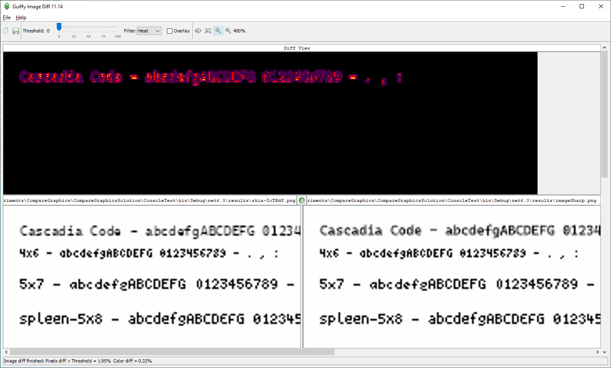
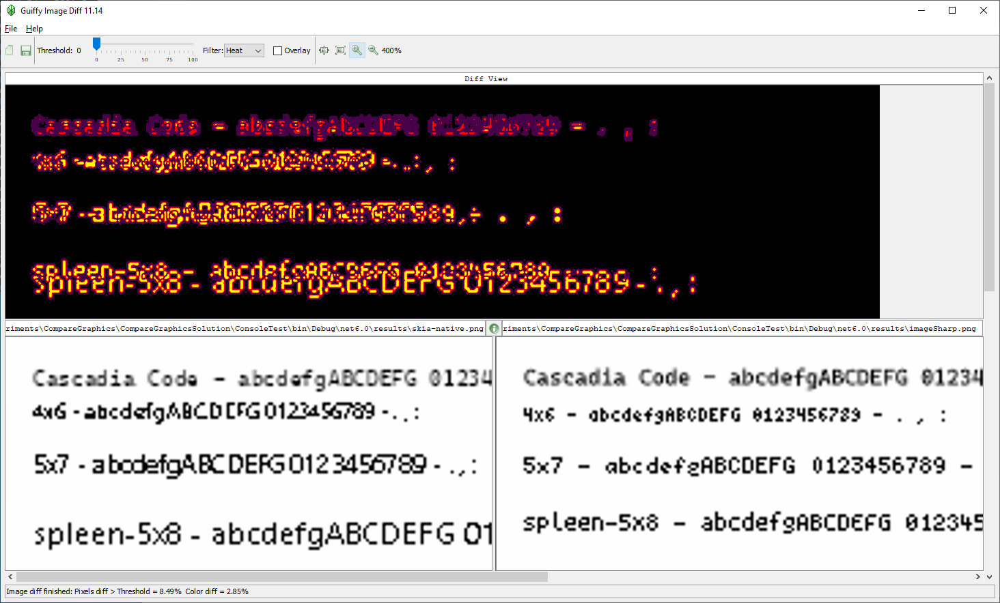

# Graphics Libraries comparison
This comparison is specifically targeted find the best library to be used in the IoT context in .NET. The main driver for this is `System.Drawing` being [deprecated](https://docs.microsoft.com/en-us/dotnet/api/system.drawing?view=dotnet-plat-ext-5.0#remarks).

The main requisites are the following:

1. Working on both Linux and Windows on the ARM platform

2. A license compatible with the [dotnet/iot](https://github.com/dotnet/iot/) libraries

I started the investigation from this blog post dated 2017: https://devblogs.microsoft.com/dotnet/net-core-image-processing/

Excluded libraries:

- The [Magick](https://github.com/dlemstra/Magick.NET) library [does not work on linux/arm](https://github.com/dlemstra/Magick.NET/issues/839) 
- The [CoreCompact](https://github.com/orgs/CoreCompat) library disappeared from the repositories list
- The [MagicScaler](https://github.com/saucecontrol/PhotoSauce) library [does not work on linux](https://github.com/saucecontrol/PhotoSauce/blob/master/readme.md)

This restricts the list to [SkiaSharp](https://github.com/mono/SkiaSharp) and [ImageSharp](https://github.com/SixLabors/ImageSharp). The comparison includes `System.Drawing.Common` to evaluate the differences with the current dotnet/iot libraries.

## Test results run on Windows

The three libraries are:

* `System.Drawing.Common`. No native `BDF` support
* `SixLabors.ImageSharp`. No native BDF support
* `SkiaSharp`. Native BDF fonts are supported

The `IoTBdfFont` in the `Common` assembly was taken from the https://github.com/dotnet/iot repository to ensure the results are consistent with the current code. This allows comparing the current status with the SkiaSharp native support.

The first comparison is between `System.Drawing.Common` and `SixLabors.ImageSharp`. Since the use the same code, the results are exactly the same (pixel perfect). See the code to evaluate the verbosity difference.

This restrict the comparison to just `SixLabors.ImageSharp` and `SkiaSharp` which I did with the native support or the BDF library. I compared the images using the [Guiffy tool](https://www.guiffy.com/).

### Left: SkiaSharp rendering with BDF class. Right: ImageSharp rendering with BDF class

The black upper part shows the differences highlighted as a heat map. The Windows "Cascadia" system font is rendered slightly different while the other does not appear in the heat map as they are exactly the same (which is obvious).

### Left: SkiaSharp rendering with native support. Right: ImageSharp rendering with BDF class

Personal evaluation:

* The SkiaSharp support for BDF is poor. I was said by A.J.Bauer (who provided the SkiaSharp code) that it depends on the C# wrapper. Probably an old version of the library has been packaged.
* The system fonts rendering is slightly different. IMO the SkiaSharp rendering is slightly more readable, but it is debatable.

* The rendering done using the BDF code in this repo is pixel perfect for SkiaSharp and ImageSharp. There are no differences at all.

* The ImageSharp packages `SixLabors.Fonts` and `SixLabors.ImageSharp.Drawing` only exists in pre-release on nuget. This is disappointing.

* SixLabors provides two distribution: one is free and the other is for payment. It is not the first time a free library changes its license to migrate to a paid one.

## Test results run on Linux-arm

I will soon run these test on a real Raspberry Pi to see if there is any difference.

